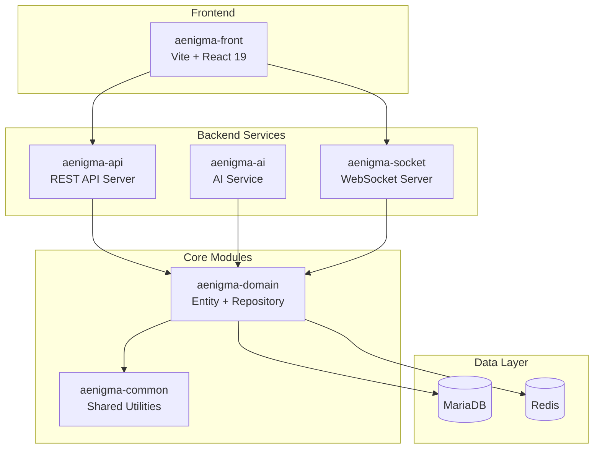
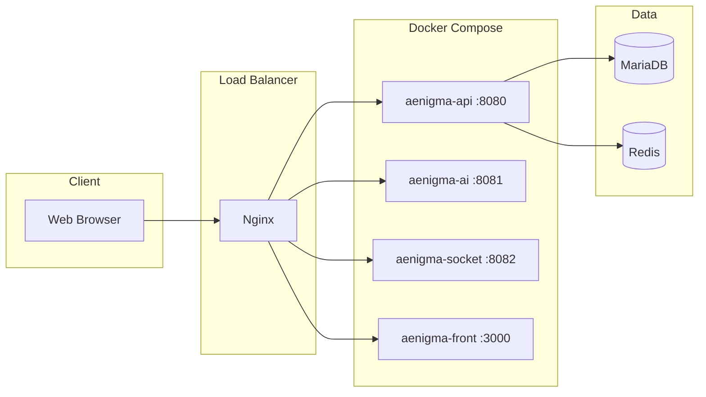

# Aenigma Project Architecture Design Report

## 📊 Current Project Structure



---

## 🔍 Module Analysis

| Module | Role | Dependencies | Status |
|--------|------|--------------|--------|
| **aenigma-common** | Shared utilities, constants, exceptions | None (bottom layer) | ⚪ Initial |
| **aenigma-domain** | Entity, Repository, Redis | common | ⚪ Initial |
| **aenigma-api** | REST API endpoints | domain | ⚪ Initial |
| **aenigma-ai** | AI/ML service integration | domain | ⚪ Initial |
| **aenigma-socket** | Real-time WebSocket | domain | ⚪ Initial |
| **aenigma-front** | React SPA | Independent | ⚪ Initial |

---

## 📦 Technology Stack

### Backend
- **Framework**: Spring Boot 3.5.9
- **Language**: Java 21 (Virtual Threads support)
- **ORM**: Spring Data JPA
- **Database**: MariaDB
- **Cache**: Redis
- **Build**: Gradle Kotlin DSL

### Frontend
- **Framework**: React 19
- **Build Tool**: Vite 7.2
- **Language**: TypeScript 5.9

---

## ✅ Current Architecture Strengths

1. **Clear Layer Separation**: common → domain → api/ai/socket hierarchy
2. **Modularity**: Each service can be deployed independently (Microservice Ready)
3. **Modern Tech Stack**: Java 21 + Spring Boot 3.5 + React 19
4. **Redis Caching**: Performance optimization foundation

---

## 🚀 Architecture Improvement Recommendations

### 1. Required Additional Modules

```diff
+ aenigma-security    # JWT, OAuth2 authentication/authorization
+ aenigma-gateway     # API Gateway (routing, load balancing)
```

### 2. Recommended Dependencies by Module

#### aenigma-common
```kotlin
dependencies {
    implementation("com.fasterxml.jackson.core:jackson-databind")
    implementation("org.apache.commons:commons-lang3:3.14.0")
    implementation("com.google.guava:guava:32.1.3-jre")
}
```

#### aenigma-api
```kotlin
dependencies {
    implementation("org.springframework.boot:spring-boot-starter-security")
    implementation("org.springframework.boot:spring-boot-starter-validation")
    implementation("org.springdoc:springdoc-openapi-starter-webmvc-ui:2.3.0")
}
```

#### aenigma-ai
```kotlin
dependencies {
    implementation("org.springframework.ai:spring-ai-openai-spring-boot-starter")
    // or
    implementation("io.github.langchain4j:langchain4j:0.35.0")
}
```

#### aenigma-socket
```kotlin
dependencies {
    implementation("org.springframework.boot:spring-boot-starter-websocket")
    implementation("org.springframework.boot:spring-boot-starter-reactor-netty")
}
```

### 3. Recommended Frontend Libraries

```json
{
  "dependencies": {
    "react-router-dom": "^7.x",
    "@tanstack/react-query": "^5.x",
    "axios": "^1.7.x",
    "zustand": "^5.x",
    "socket.io-client": "^4.x"
  }
}
```

---

## 📐 Recommended Directory Structure

### Backend (each module)
```
aenigma-api/src/main/java/com/aenigma/api/
├── controller/          # REST controllers
├── dto/                 # Request/Response DTOs
├── service/             # Business logic
├── config/              # Configuration classes
└── exception/           # Exception handling

aenigma-domain/src/main/java/com/aenigma/domain/
├── entity/              # JPA entities
├── repository/          # Repository interfaces
├── service/             # Domain services
└── event/               # Domain events
```

### Frontend
```
aenigma-front/src/
├── components/          # Reusable components
├── pages/               # Page components
├── hooks/               # Custom hooks
├── services/            # API calls
├── stores/              # State management
├── types/               # TypeScript types
└── utils/               # Utility functions
```

---

## 🔒 Security Recommendations

1. **JWT + Redis Session**: Token-based authentication + session management
2. **Spring Security 6**: CORS, CSRF, XSS protection
3. **API Rate Limiting**: Redis-based request throttling
4. **HTTPS Enforcement**: Nginx/API Gateway level

---

## 🐳 Recommended Deployment Structure



---

## 📋 Recommended Next Steps

| Priority | Task | Description |
|:--------:|------|-------------|
| 1️⃣ | Entity Design | Define core entities in aenigma-domain |
| 2️⃣ | Security Module | JWT authentication + Spring Security setup |
| 3️⃣ | API Implementation | REST endpoints + Swagger documentation |
| 4️⃣ | Frontend Routing | React Router + basic page structure |
| 5️⃣ | Docker Setup | Write docker-compose.yml |
| 6️⃣ | CI/CD | Build GitHub Actions pipeline |

---

> [!TIP]
> Since the project is in its early stages, it is recommended to first define core entities in **aenigma-domain**
> and implement basic CRUD APIs in **aenigma-api**.
