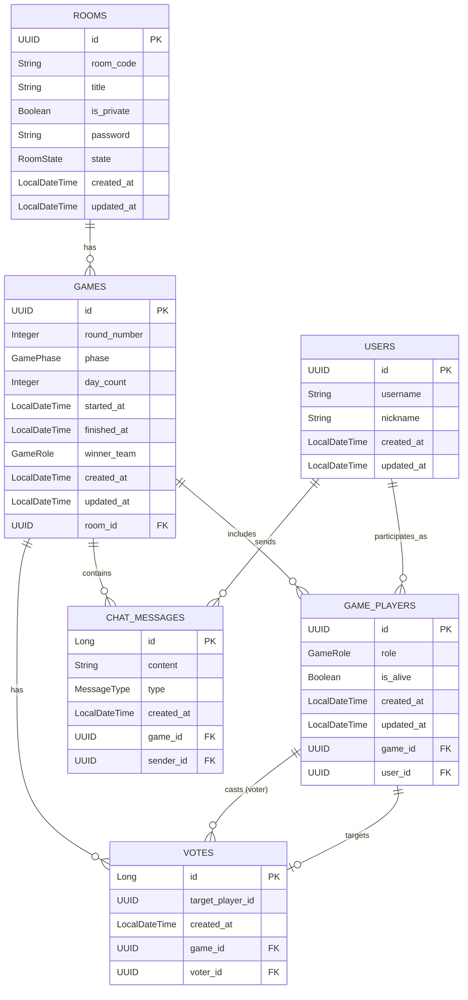

# Aenigma ERD (Entity Relationship Diagram)

## Description
- **USERS**: 플랫폼 가입 사용자
- **ROOMS**: 게임 대기방 (게임 시작 전)
- **GAMES**: 실제 진행되는 게임 세션 (Room 1 : N Game)
- **GAME_PLAYERS**: 특정 게임에 참여한 사용자 정보 (역할, 생존여부 등)
- **CHAT_MESSAGES**: 게임 내 채팅 로그
- **VOTES**: 최종 투표 기록
