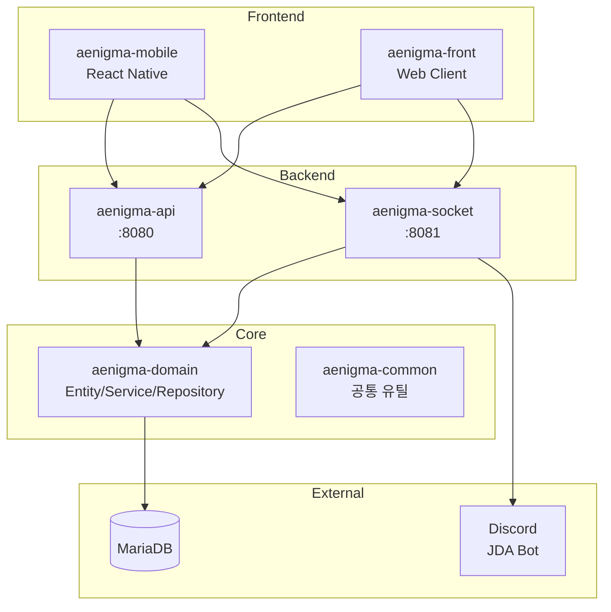
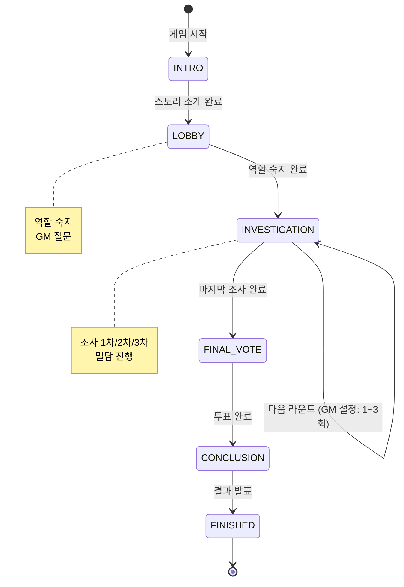
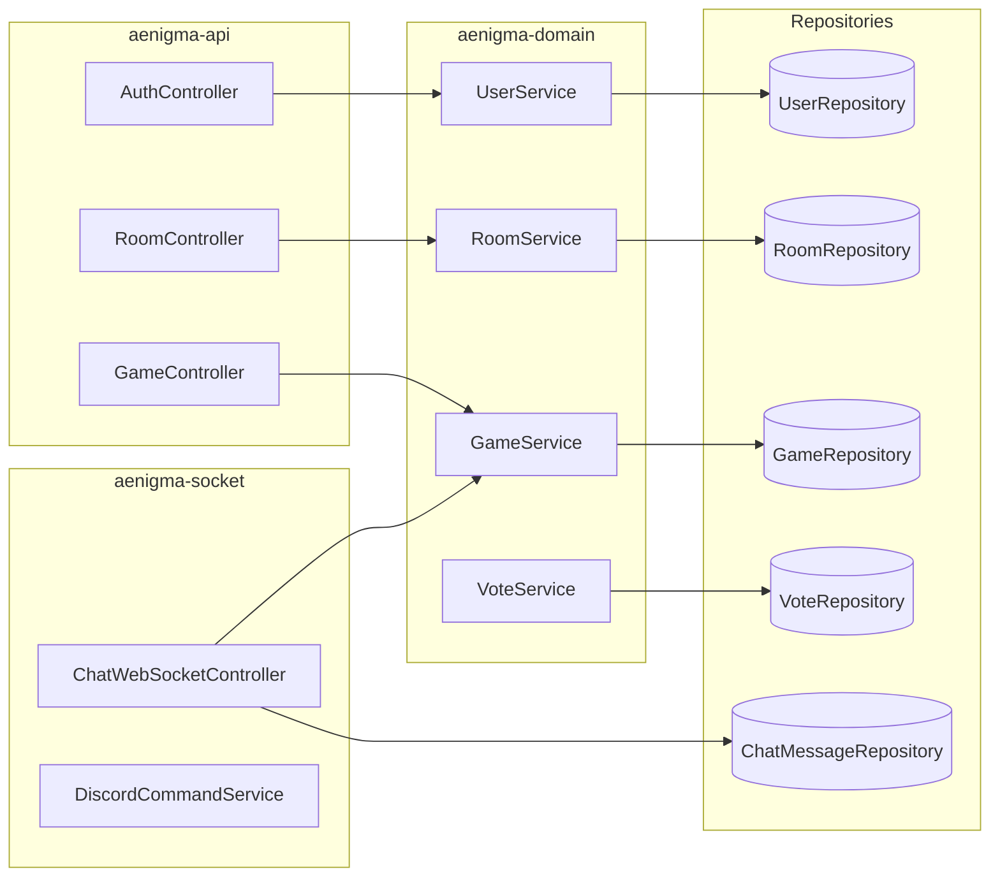
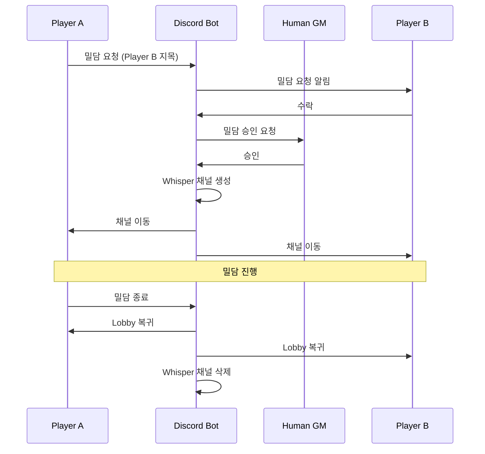
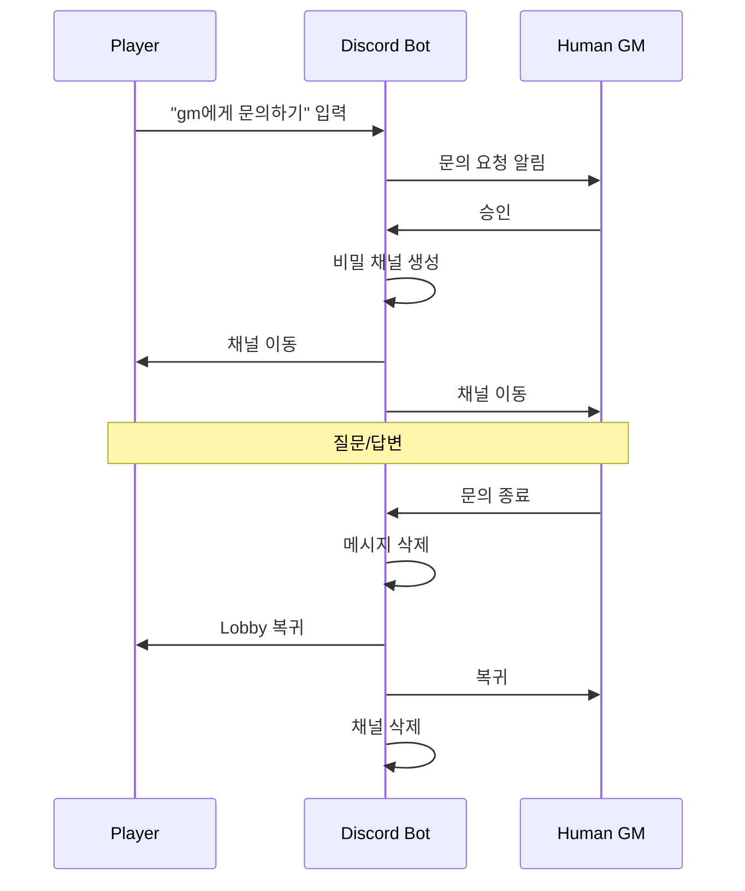
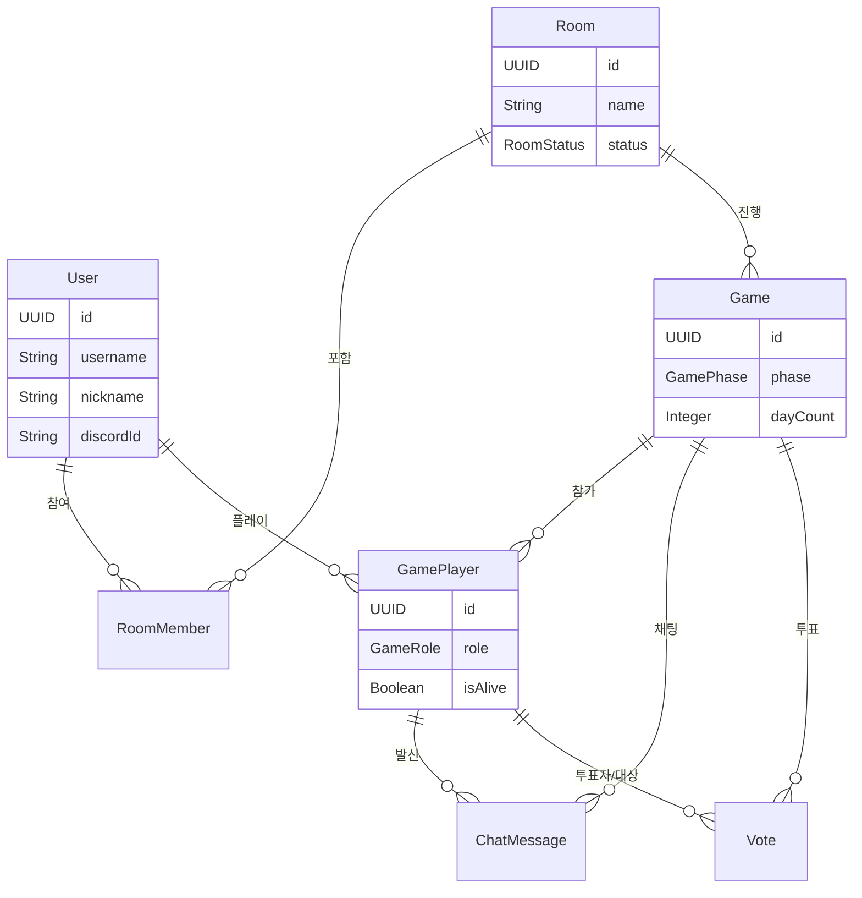

# Aenigma 프로젝트 흐름도

## 📦 멀티모듈 아키텍처

```mermaid
flowchart TB
    subgraph Frontend
        Mobile[aenigma-mobile<br/>React Native]
        Web[aenigma-front<br/>Web Client]
    end
    
    subgraph Backend
        API[aenigma-api<br/>:8080]
        Socket[aenigma-socket<br/>:8081]
    end
    
    subgraph Core
        Domain[aenigma-domain<br/>Entity/Service/Repository]
        Common[aenigma-common<br/>공통 유틸]
    end
    
    subgraph External
        Discord[Discord<br/>JDA Bot]
        DB[(MariaDB)]
    end
    
    Mobile --> API
    Mobile --> Socket
    Web --> API
    Web --> Socket
    
    API --> Domain
    Socket --> Domain
    Socket --> Discord
    Domain --> DB
```

---

## 🎮 게임 페이즈 흐름

```mermaid
stateDiagram-v2
    [*] --> INTRO: 게임 시작
    INTRO --> LOBBY: 스토리 소개 완료
    LOBBY --> INVESTIGATION: 역할 숙지 완료
    INVESTIGATION --> INVESTIGATION: 다음 라운드 (GM 설정: 1~3회)
    INVESTIGATION --> FINAL_VOTE: 마지막 조사 완료
    FINAL_VOTE --> CONCLUSION: 투표 완료
    CONCLUSION --> FINISHED: 결과 발표
    FINISHED --> [*]
    
    note right of LOBBY: 역할 숙지<br/>GM 질문
    note right of INVESTIGATION: 조사 1차/2차/3차<br/>밀담 진행
```

---

## 🔗 API 계층 구조

```mermaid
flowchart LR
    subgraph aenigma-api
        AuthC[AuthController]
        RoomC[RoomController]
        GameC[GameController]
    end
    
    subgraph aenigma-socket
        ChatWS[ChatWebSocketController]
        DiscordCmd[DiscordCommandService]
    end
    
    subgraph aenigma-domain
        US[UserService]
        RS[RoomService]
        GS[GameService]
        VS[VoteService]
    end
    
    subgraph Repositories
        UR[(UserRepository)]
        RR[(RoomRepository)]
        GR[(GameRepository)]
        VR[(VoteRepository)]
        CR[(ChatMessageRepository)]
    end
    
    AuthC --> US
    RoomC --> RS
    GameC --> GS
    ChatWS --> GS
    ChatWS --> CR
    
    US --> UR
    RS --> RR
    GS --> GR
    VS --> VR
```

---

## 🤫 밀담 시스템 흐름

```mermaid
sequenceDiagram
    participant A as Player A
    participant Bot as Discord Bot
    participant GM as Human GM
    participant B as Player B
    
    A->>Bot: 밀담 요청 (Player B 지목)
    Bot->>B: 밀담 요청 알림
    B->>Bot: 수락
    Bot->>GM: 밀담 승인 요청
    GM->>Bot: 승인
    Bot->>Bot: Whisper 채널 생성
    Bot->>A: 채널 이동
    Bot->>B: 채널 이동
    Note over A,B: 밀담 진행
    A->>Bot: 밀담 종료
    Bot->>A: Lobby 복귀
    Bot->>B: Lobby 복귀
    Bot->>Bot: Whisper 채널 삭제
```

---

## ❓ GM 문의 흐름

```mermaid
sequenceDiagram
    participant P as Player
    participant Bot as Discord Bot
    participant GM as Human GM
    
    P->>Bot: "gm에게 문의하기" 입력
    Bot->>GM: 문의 요청 알림
    GM->>Bot: 승인
    Bot->>Bot: 비밀 채널 생성
    Bot->>P: 채널 이동
    Bot->>GM: 채널 이동
    Note over P,GM: 질문/답변
    GM->>Bot: 문의 종료
    Bot->>Bot: 메시지 삭제
    Bot->>P: Lobby 복귀
    Bot->>GM: 복귀
    Bot->>Bot: 채널 삭제
```

---

## 📁 도메인 엔티티 관계

```mermaid
erDiagram
    User ||--o{ RoomMember : "참여"
    Room ||--o{ RoomMember : "포함"
    Room ||--o{ Game : "진행"
    Game ||--o{ GamePlayer : "참가"
    User ||--o{ GamePlayer : "플레이"
    Game ||--o{ ChatMessage : "채팅"
    GamePlayer ||--o{ ChatMessage : "발신"
    Game ||--o{ Vote : "투표"
    GamePlayer ||--o{ Vote : "투표자/대상"
    
    User {
        UUID id
        String username
        String nickname
        String discordId
    }
    Room {
        UUID id
        String name
        RoomStatus status
    }
    Game {
        UUID id
        GamePhase phase
        Integer dayCount
    }
    GamePlayer {
        UUID id
        GameRole role
        Boolean isAlive
    }
```
